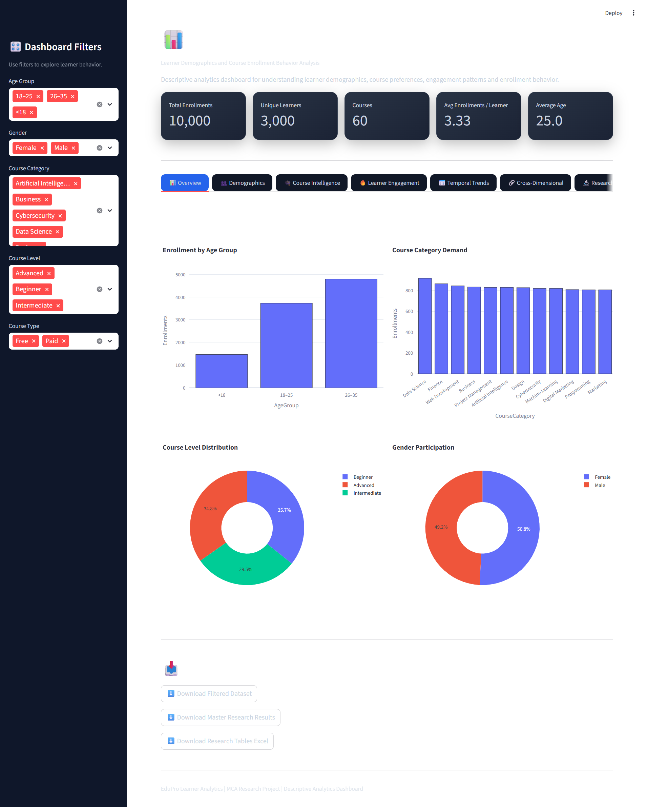
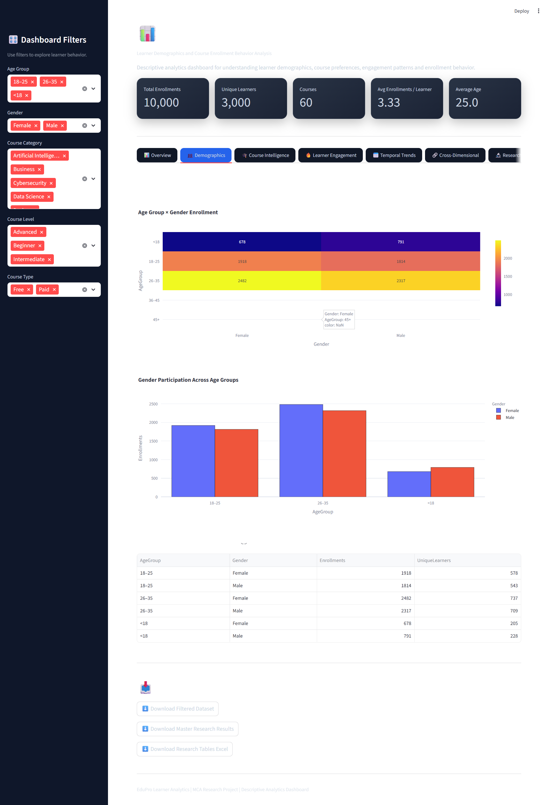
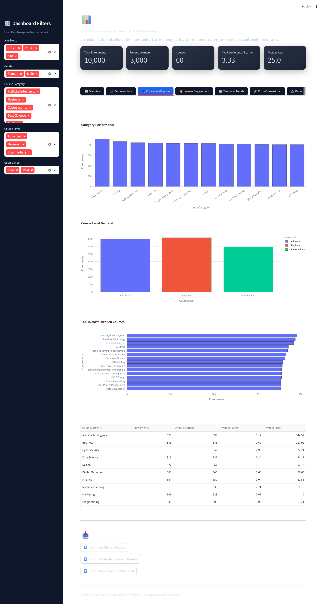
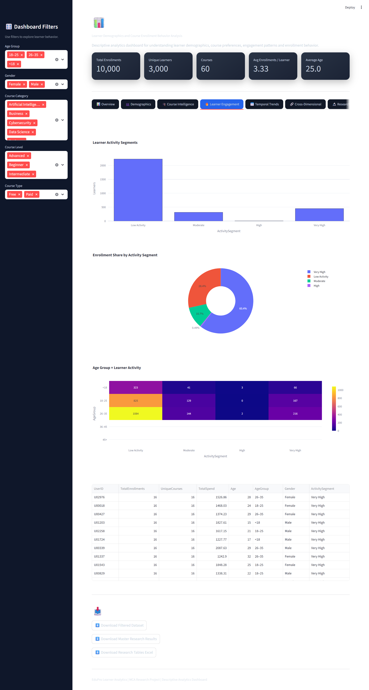
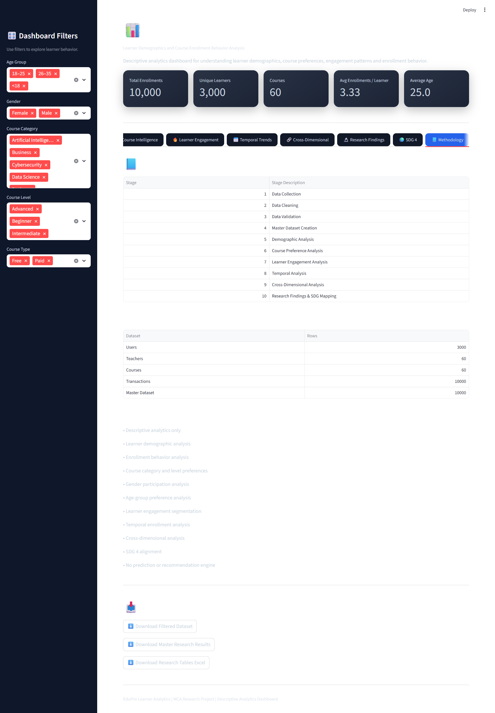

# 📊 EduPro – Learner Demographics & Course Enrollment Behavior Analysis

[](https://www.python.org/)
[](https://streamlit.io/)
[](https://pandas.pydata.org/)
[](https://plotly.com/)
[]()

## 🎯 Project Overview

**EduPro – Learner Demographics and Course Enrollment Behavior Analysis**
is a descriptive analytics project designed to understand learner
demographics, course enrollment patterns, course preferences and
learner engagement behavior.

The project analyzes relationships between:

- Learner age groups
- Gender
- Course categories
- Course levels
- Course types
- Enrollment behavior
- Learner activity
- Temporal enrollment trends

An interactive Streamlit dashboard is provided for exploring the
analytical results.

---

## 🔍 Research Questions

1. Which age groups are most active on the EduPro platform?
2. How does enrollment behavior differ by gender?
3. Which course categories are preferred by different learner segments?
4. Are beginner, intermediate and advanced courses more popular among
   specific age groups?
5. How does learner activity vary across demographic segments?
6. What enrollment patterns can support education and skills-development
   planning?

---

## 🛠️ Technology Stack

| Technology | Purpose |
|---|---|
| Python | Data analysis and application development |
| Pandas | Data preprocessing and analysis |
| NumPy | Numerical computation |
| Matplotlib | Statistical visualization |
| Seaborn | Heatmaps and analytical visualization |
| Plotly | Interactive visualizations |
| Streamlit | Interactive dashboard |
| Excel | Source dataset |
| OpenPyXL | Excel processing |

---

## 📊 Key Analysis Areas

### 👥 Learner Demographics
- Age-group distribution
- Gender participation
- Age × gender analysis
- Learner activity segmentation

### 📚 Course Preferences
- Course category popularity
- Course level preference
- Course type preference
- Age × category analysis
- Age × level analysis
- Gender × category analysis
- Gender × level analysis

### 📈 Enrollment Behavior
- Monthly enrollment trends
- Yearly enrollment trends
- Learner activity
- Course diversity
- Enrollment concentration
- Top courses

### 🎓 Education & SDG Relevance

The analysis provides descriptive evidence that can support
**SDG 4 – Quality Education**, particularly in understanding
participation, skills-development preferences and demographic
enrollment patterns.

The project does **not** claim to measure or prove SDG achievement.

---

## 📱 Interactive Dashboard

The Streamlit dashboard provides:

- KPI cards
- Demographic analysis
- Course intelligence
- Learner behavior analysis
- Interactive filters
- Interactive Plotly charts
- Heatmaps
- Temporal analysis
- Research insights
- CSV data downloads

---

## 📁 Project Structure

```text
EduPro-Learner-Analytics/
│
├── app.py
├── analysis.py
├── final_validation.py
├── research_paper.py
├── create_research_docx.py
├── README.md
├── requirements.txt
│
├── data/
│   └── EduPro.xlsx
│
└── outputs/
    └── reports/
    ## 📸 Dashboard Preview

### 📊 Dashboard Overview



### 👥 Demographics Analysis



### 📚 Course Intelligence



### 📈 Learner Behavior



### 💡 Insights & Analysis


### 🔍 Methodology & Data Validation

